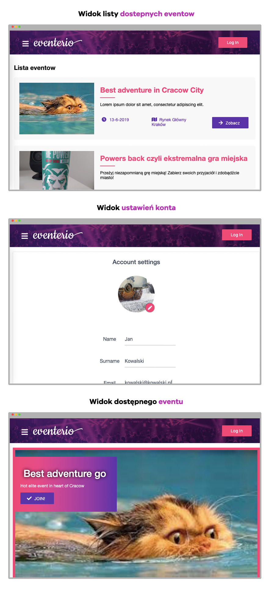

# Eventerio
**Let Us Find Your Next Event**

Aplikacja pozwalająca zarejestrowanym użytkownikom dodawać, wyświetlać i brać udział w wydarzeniach oraz ograniczać wyświetlane wydarzenia do określonej odległości od swojej lokalizacji.

**Eliza Tomasiak** - grupa: KrDZIs3011Io - nr indeksu: 201720

**Dawid Szafrański**  - grupa: KrDZIs3011Io - nr indeksu: 201557

**Maciej Przybylski** - grupa: KrDZIs3011Io - nr indeksu: 187911

**Patryk Ruszaj** - grupa: KrDZIs3012Io - nr indeksu: 188015 - *KIEROWNIK PROJEKTU*

**Celem** aplikacji jest umożliwienie użytkownikom wyszukiwanie wydarzeń w swojej okolicy dzięki określaniu odległości względem swojej lokalizacji. 

**Główną cechą** serwisu jest łatwość obłsugi dzięki przejrzystemu interfejsowi oraz minimalnych formalnościach potrzebnych do wykonania celu.

## Zbiór linków do projektu

- [Strona aplikacji](https://pwa-test-10466.firebaseapp.com/)

- [Prototyp](https://xd.adobe.com/view/6760066f-6fde-4236-409b-0788d1490c25-1151/)

- [Zarządzanie projektem](https://github.com/sabeq96/Eventerio/projects/1)

- [Repozytorium](https://github.com/sabeq96/Eventerio)

